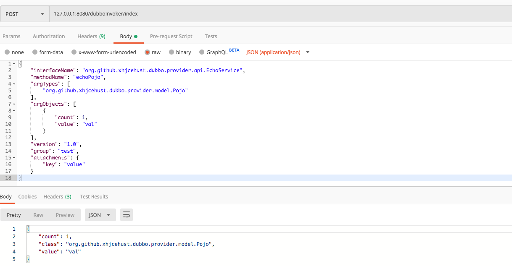

# dubbo-invoker

### 一、功能
   实现http->dubbo的转换，任意dubbo接口都可以通过http请求来转发代理实现,支持dubbo attachments，可部署用于测试环境的dubbo接口调试
### 二、用法

#### 1.本地启动注册中心zk

默认注册中心的地址是zookeeper://127.0.0.1:2181，如需替换，修改
dubbo-invoker-provider/src/main/resources/dubbo-demo-provider.xml
和dubbo-invoker-proxy/src/main/resources/application.properties中的注册中心配置

#### 2.启动示例dubbo-invoker-provider: 

```org.github.xhjcehust.dubbo.provider.Provider#main```
* 注：dubbo-invoker-provider仅用于provider demo展示，如果已经部署了dubbo provider，可跳过此步骤

#### 3.启动dubbo-invoker-proxy:

```org.github.xhjcehust.dubbo.proxy.DubboInvokerApplication#main```

#### 4.http请求示例

* curl请求：
```
curl -H "Content-type: application/json" -X POST -d '
{
    "interfaceName": "org.github.xhjcehust.dubbo.provider.api.EchoService",
    "methodName": "echoPojo",
    "argTypes": [
        "org.github.xhjcehust.dubbo.provider.model.Pojo"
    ],
    "argObjects": [
        {
            "count": 1,
            "value": "val"
        }
    ],
    "version": "1.0",
    "group": "test",
    "attachments": {
        "key": "value"
    }
}' http://127.0.0.1:8080/dubboInvoker/index
```
返回：
```
{"count":1,"class":"org.github.xhjcehust.dubbo.provider.model.Pojo","value":"val"}
```
* postman请求：


